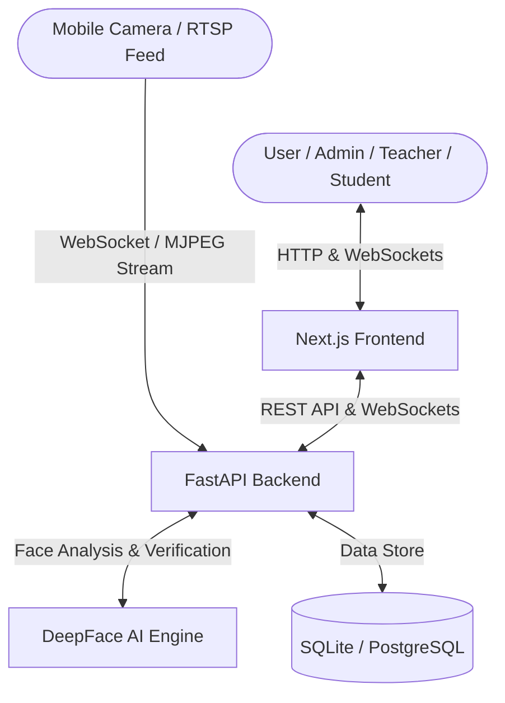

# Presenza AI 🌌

> **Intelligent Presence, Attendance, and Behavioural Analysis — Redefined.**

Presenza AI is a next-generation, premium enterprise solution for real-time presence tracking, attendance management, and behavioural analysis. Combining a stunning, fluid web frontend built on Next.js with a lightning-fast FastAPI backend and advanced DeepFace facial recognition, Presenza AI brings modern intelligence, absolute precision, and maximum security to modern organizations.

---

## 🌟 Key Features

*   **Real-Time Facial Recognition**: DeepFace-driven face detection, enrollment, and verification.
*   **Real-Time Live Streaming**: Support for camera stream ingestion, RTSP feeds, WebSockets, and WebRTC streaming.
*   **Mobile Stream Capability**: Stream directly from any smartphone to the AI processing engine by visiting `/mobile` on your mobile browser.
*   **Dynamic Role-Based Dashboards**: Curated workspaces tailored specifically for **Admins**, **Teachers**, and **Students**.
*   **Telemetry & Analytics**: Beautiful engagement metrics, tracking telemetry, and interactive charts.
*   **Spoofing & Fraud Detection**: Real-time logging, audit trails, and automatic flags for potential presence fraud.
*   **WebSockets Telemetry**: Push-based immediate attendance notifications and alerts directly into the user interface.

---

## 🏗️ Architecture



---

## 📁 Repository Structure

```
Presenza-AI/
├── backend/                # FastAPI backend codebase
│   ├── app/                # Main application package
│   │   ├── ai_engine/      # DeepFace integration & model loading
│   │   ├── core/           # Security, config, logger, and exception managers
│   │   ├── database/       # DB connection, base models, session factory
│   │   ├── models/         # SQLAlchemy DB models
│   │   ├── routers/        # API route handlers (auth, attendance, stream, etc.)
│   │   └── services/       # Core business logic handlers
│   ├── alembic/            # Database migrations
│   ├── static/             # Static files (e.g., /mobile camera streaming web client)
│   └── tests/              # Pytest backend test suite
├── frontend/               # Next.js frontend codebase
│   ├── public/             # Static assets
│   └── src/                # Frontend source code
│       ├── app/            # Next.js App Router (Pages: Admin, Teacher, Student dashboards)
│       ├── components/     # UI Design System (Framer Motion, Magnetic Buttons, Layouts)
│       ├── context/        # React context (Auth and global state)
│       ├── hooks/          # Custom hooks
│       └── utils/          # Configuration and network utilities
├── database/               # Additional DB scripts & migration batch scripts
├── deployment/             # Server deployment configuration templates
├── docker-compose.yml      # Docker Multi-Container Configuration
├── deployment.md           # Production cloud deployment guide
└── start_production.ps1    # Automated setup and execution script (PowerShell)
```

---

## 🚀 Getting Started

You can run Presenza AI in two ways: **Docker Compose** (recommended for production-like environments) or **Manual Setup** (recommended for local development).

### Option 1: Quickstart using Docker Compose 🐳

Ensure you have [Docker Desktop](https://www.docker.com/products/docker-desktop/) installed and running.

1.  **Clone the Repository**:
    ```bash
    git clone https://github.com/your-username/Presenza-AI.git
    cd Presenza-AI
    ```

2.  **Start Services**:
    ```bash
    docker compose up --build -d
    ```

3.  **Access the System**:
    *   **Frontend**: [http://localhost:3000](http://localhost:3000)
    *   **Backend API**: [http://localhost:8000](http://localhost:8000)
    *   **Interactive API Docs**: [http://localhost:8000/docs](http://localhost:8000/docs)
    *   **Mobile Streaming Client**: [http://localhost:8000/mobile](http://localhost:8000/mobile)

---

### Option 2: Script-Based Local Startup 💻

For Windows users who wish to run the app natively without Docker:

1.  **Run DB Migrations**:
    ```cmd
    :: Set up database schema
    migrate_db.bat
    ```

2.  **Run the App**:
    ```powershell
    # Execute the build & launch script (requires python & nodejs installed locally)
    .\start_production.ps1
    ```

---

### Option 3: Manual Step-by-Step Setup ⚙️

If you want absolute control and wish to run backend and frontend separately in development mode:

#### 1. Backend Setup (FastAPI)

1.  Navigate to the `backend` folder:
    ```bash
    cd backend
    ```

2.  Create and activate a virtual environment:
    ```bash
    # On Windows:
    python -m venv .venv
    .venv\Scripts\activate

    # On macOS/Linux:
    python3 -m venv .venv
    source .venv/bin/activate
    ```

3.  Install dependencies:
    ```bash
    pip install --upgrade pip
    pip install -r requirements.txt
    ```

4.  Configure the Environment:
    Create a `.env` file inside the `backend` directory (see `.env.example` as a template):
    ```env
    SECRET_KEY=your_development_secret_key_here
    DATABASE_URL=sqlite:///./presenza.db
    DEBUG=True
    ALLOWED_ORIGINS=["http://localhost:3000"]
    ```

5.  Seed the database:
    ```bash
    python seed_full_db.py
    ```

6.  Launch the FastAPI server:
    ```bash
    uvicorn app.main:app --reload --host 0.0.0.0 --port 8000
    ```

#### 2. Frontend Setup (Next.js)

1.  Navigate to the `frontend` folder:
    ```bash
    cd ../frontend
    ```

2.  Install packages:
    ```bash
    npm install
    ```

3.  Configure Environment:
    Create a `.env.local` file inside the `frontend` folder:
    ```env
    NEXT_PUBLIC_API_URL=http://localhost:8000
    ```

4.  Run Next.js Dev Server:
    ```bash
    npm run dev
    ```

5.  Open [http://localhost:3000](http://localhost:3000) in your browser.

---

## 🛠️ Tech Stack & Key Libraries

### Backend
*   **FastAPI**: Highly performant ASGI framework for web APIs.
*   **DeepFace**: Lightweight face recognition and facial attribute analysis (age, gender, emotion, and race).
*   **SQLAlchemy / Alembic**: Database mapping (ORM) and automatic migrations.
*   **Uvicorn / WebSockets**: Async gateway interface and bidirectional real-time communication.
*   **Pydantic**: Data parsing, structural validation, and settings management.

### Frontend
*   **Next.js (App Router)**: Hybrid server-rendering and static hosting framework.
*   **TypeScript**: Static type safety for robust application logic.
*   **TailwindCSS**: Premium utility-first styling.
*   **Framer Motion**: State-of-the-art interactive micro-animations and physical fluid transitions.
*   **Lucide React**: Clean and minimal modern iconography.

---

## ☁️ Cloud Deployment

For deploying the production application on Cloud VMs (like AWS EC2, GCP, DigitalOcean) with secure firewalls, custom domain configs, and production logs, please consult the complete guide in [deployment.md](file:///c:/Users/Aniket/Downloads/Presenza-AI/deployment.md).

---

## 🔍 Troubleshooting

*   **Camera Black Screen**: Modern browsers restrict camera stream inputs to secure contexts (`https://` or `localhost`). If testing over a local network, configure an SSL reverse proxy or access via `localhost`.
*   **WebSocket Disconnections**: When running behind Nginx or custom API gateways, verify that WebSocket upgrade headers are explicitly configured:
    ```nginx
    proxy_set_header Upgrade $http_upgrade;
    proxy_set_header Connection "upgrade";
    ```
*   **Face Recognition Speed**: Ensure your server has sufficient memory and CPU resources, as loading and computing model weights requires computational overhead. In production, consider provisioning a GPU-enabled instance.
